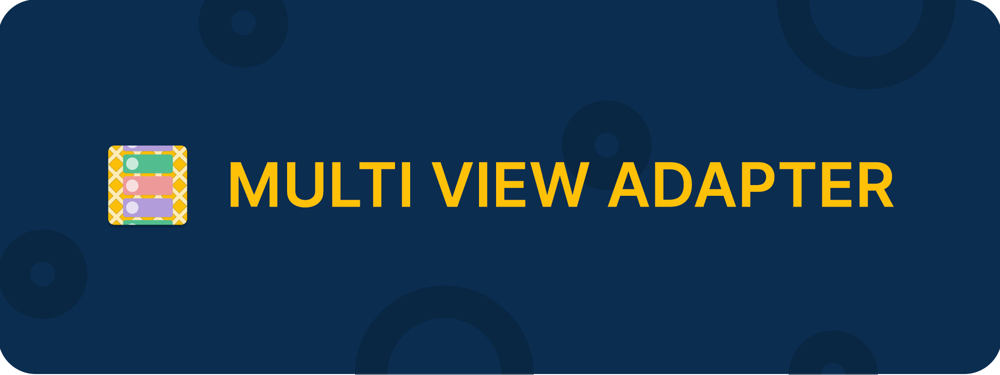

## MultiViewAdapter

Welcome to MultiViewAdapter Documentation! Everything you need to know about the MultiViewAdapter project is documented here.

### How this documentation is organized

MultiViewAdapter has a lot of documentation. A high-level overview of how it’s organized will help you know where to look for certain things:

* [Overview](#overview) gives high level information about this library.
* [Getting started](#getting-started) will guide you through steps for creating a recyclerview adapter. Start here if you’re new to MultiViewAdapter.
* [Feature guides](#feature-guides) discusses key features in-depth and provide useful background information and explanation.
* [References](#references) contains JavaDocs for core library and extensions. Also it discusses the core concepts of the MultiViewAdapter.
<!-- * [Cookbook](#cookbook) contain recipes. They guide you through the steps involved in creating complex recyclerview adapter. They are more advanced than tutorials and assume some knowledge of how MultiViewAdapter works. -->

#### Overview

Learn about this project.

  - [Introduction](website/overview/introduction.md) - Gives you an overview about this project's origin.
  - [Why MultiViewAdapter](website/overview/comparison.md) - Compares the MultiViewAdapter with vanilla RecyclerView's adapter.

#### Getting started

If you are new to MultiViewAdapter you might want to start here.

  - [Setup](website/getting_started/setup.md) - Gradle dependency information.
  - [Basic Usage](website/getting_started/basic_usage.md) - How to set up a simple adapter.
  <!-- - [Advanced Usage](getting_started/advanced_usage.md) - Set up an adapter with complex UI and features. -->

#### Feature Guides

Learn in-depth about implementing various features of MultiViewAdapter.

  - [Selection](website/feature/selection.md) - Learn all about to make your adapter 'selectable'
  - [Expansion](website/feature/expansion.md) - Do you know that you can expand both an item and a section? 
  - [Decoration](website/feature/decoration.md) - Learn more about decoration feature inside MultiViewAdapter.
  - [Grid & Spans](website/feature/spans.md) - Learn more about setting a complex span counts.
  - [Payload and DiffUtil](website/feature/diffutil.md) - Learn about using payload and diffutil provider.
  - [Swipe to dismiss](website/feature/swipe_dismiss.md) - Learn about integrating swipe to dismiss feature.
  - [Drag and Drop](website/feature/drag_drop.md) - Learn about integrating drag and drop feature.
  - [Infinite Scrolling](website/feature/infinite_scroll.md) - Learn about integrating infinite scrolling feature.

#### Extensions

Not all features can be added to the core library. Some niche features can be added as extensions.

  - [Data Binding](website/extension/data_binding.md) - Learn about DataBinding extension
  - [Decorators](website/extension/decorations.md) - Some decorators are provided by default. Learn how to use them.
  - [RxDiffUtil](website/extension/rx_diffutil.md) - By deafult DiffUtil runs in UI thread. This extension is a lightweight wrapper around the DiffUtil in reactive stream.

#### References

Contains the technical reference for API's and concepts behind the adapter in-depth.

  - [Concepts](website/references/concepts.md) - Learn about the core parts of the library.
  - [JavaDoc](https://devahamed.github.io/MultiViewAdapter/javadocs/index.html) - JavaDocs to learn more about the API's.

#### Project

  - [Contribute](website/project/contribute.md)
  <!-- - [Hall of fame](project/hall_of_fame.md) -->
  - [Credits](website/project/credits.md)
