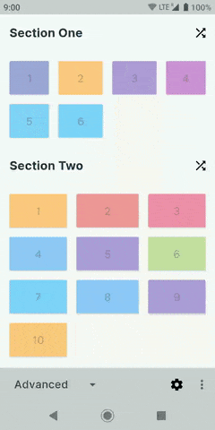
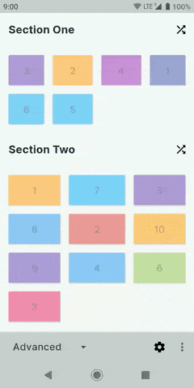
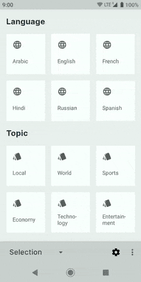
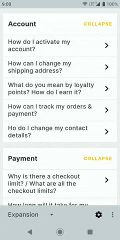
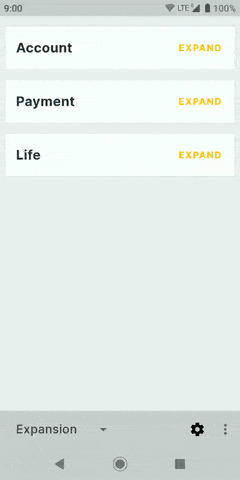

[](https://github.com/DevAhamed/MultiViewAdapter/blob/master/LICENSE)
[](https://codecov.io/gh/DevAhamed/MultiViewAdapter)
[](https://www.bitrise.io/app/7f9137a2f1df08c1)

Recyclerview is one of the powerful widgets inside android framework. But creating adapters with multiple view types is always exhausting. Not anymore. MultiViewAdapter makes it easy for you to create adapter with multiple view types easily. Using the library you will be able to build composable view holders, which can be re-used across your app. Apart from this, MultiViewAdapter adds many other useful features into the library as add-ons.

> :tada::tada: MultiViewAdapter v3.0 supports AndroidX. v3.0 is identical to v2.0 except for package name changes and androidx support.

# Contents

1. [Why this library](#why-this-library)
2. [Feature Showcase](#feature-showcase)
3. [Gradle Dependency](#gradle-dependency)
4. [Core Concepts](#core-concepts)
5. [Basic Usage](#basic-usage)
6. [Advanced Usage](#advanced-usage)
7. [Learn More](#learn-more)
8. [Changelog](#changelog)
9. [Contribution](#contribution)
10. [Credits](#credits)
11. [Hall of fame](#hall-of-fame)
12. [License](#license)

---

## Why this library?

Have you ever displayed multiple view types inside a single adapter? Have you ever added selection mode to an adapter? Have you ever set different span size to different items inside a single adapter? Have you ever added swipe-to-dismiss / drag & drop / infinite scrolling features to your adapter?

If you answered yes, then you must know how hard it is to do any one of these. What if you had to add all of these inside a single adapter. Phew.

### Problems with default adapter

 1. In default adapter approach, code is not re-usable as it is.
 2. If you have to add multiple viewtypes the code grows painfully.
 3. If the data needs to be updated, its hard to write the updation logic and call the correct notify method.

### Problems with similar libraries

To solve the above problems, you can also use a different library or libraries. But such libraries have a common restrictions - Your data model will be polluted with the view logic.

1. Your data objects should extend/implement from library's model, which can interfere with your object hierarchy.
2. View holder creation and binding has to be written inside the data model. You are forced to keep layout and view references inside the model class itself.
3. For complex lists, generic notifyDataSetChanged method will be called during updation. Also these libraries don’t take advantage of DiffUtil.
4. You have to write switch cases, if you want to have different item-decorations/span-size/selection-modes/expansion-modes for different view types.
5. You lose the 'type' information when accessing objects ie., you need to cast the object every time you need it.

MultiViewAdapter solves all of these requirements. The library was specifically designed in a way to not interfere with your object modeling and hierarchy.

---

## Feature Showcase

Here are the few features which are possible with this library.

Multiple Viewtypes | Multiple Spans | Other Features
-------------------- | -------------------- | --------------------
 |  | 

Selection | Item Expansion | Section Expansion
-------------------- | -------------------- | --------------------
 |  | 

---

## Gradle Dependency

The library is available via JCenter. JCenter is the default maven repository used by Android Studio. The minimum API level supported by this library is API 14.

### Adding Library

[](https://bintray.com/devahamed/MVA2/adapter/_latestVersion)

```gradle
dependencies {
    implementation 'dev.ahamed.mva2:adapter:2.0.0-alpha01'
}
```

### Adding Extension

[](https://bintray.com/devahamed/MVA2/adapter/_latestVersion)

```gradle
dependencies {
    implementation 'dev.ahamed.mva2:ext-databinding:2.0.0-alpha01'  // DataBinding
    implementation 'dev.ahamed.mva2:ext-decorator:2.0.0-alpha01'    // Decorators
    implementation 'dev.ahamed.mva2:ext-diffutil-rx:2.0.0-alpha01'  // RxDiffUtil
}
```

### Using Snapshot Version

Just add '-SNAPSHOT' to the version name

```gradle
dependencies {
    implementation 'dev.ahamed.mva2:adapter:2.0.0-SNAPSHOT' // Library
}
```

To use the above snapshot version add the following to your project's gradle file

```gradle
allprojects {
    repositories {
        maven {
            url 'https://oss.jfrog.org/artifactory/oss-snapshot-local'
        }
    }
}
```

---

## Core Concepts

Core mantra of MultiViewAdapter - Separation of view logic from data management logic. You get two different components which are :

1. Section - Component to hold your data. All data related updates will run here and proper notify method will be called on the adapter.
2. ItemBinder - Component which creates and binds your view holder. All view related logic should go here.

### Section

Section is the building block for MultiViewAdapter. Section will hold your data which needs to be displayed inside the recyclerview -  data can be a single item or list of items. When the underlying data is changed the section will calculate the diff and call the correct notify method inside the adapter. You can add as many as Section to an adapter.


There are different types of sections.

|Name|Description|
|---|---|
|ItemSection|Section to display single item|
|ListSection|Section to display list of items|
|HeaderSection|Section to display list of items along with a header|
|NestedSection|Section which can host other section|
|TreeSection|Section which can display items in tree fashion. Ex: Comment list|

### ItemBinder

ItemBinder is the class where all view related code should be written. ItemBinder is responsible for creating and binding view holders. The method signatures are kept close to the default ```RecyclerView.Adapter``` method signatures. For each viewtype inside the recyclerview, you need to create an ItemBinder.

ItemBinder allows you to have different decoration for different view types. Apart from this, with ItemBinder you will be able to add Swipe-to-dismiss, drag and drop features.

---

## Basic Usage

Lets create an adapter which displays a list of cars. Follow these steps.

1. You need to create an ItemBinder for your model. ItemBinder is responsible for creating and binding your view holders. Following is the code snippet of ItemBinder for CarModel class.

### CarBinder

```java
public class CarBinder extends ItemBinder<CarModel, CarBinder.CarViewHolder> {

  @Override public CarViewHolder createViewHolder(ViewGroup parent) {
      return new CarViewHolder(inflate(R.layout.item_car, parent));
  }

  @Override public boolean canBindData(Object item) {
      return item instanceof CarModel;
  }

  @Override public void bindViewHolder(CarViewHolder holder, CarModel item) {
      holder.tvCarName.setText(item.getName());
  }

  static class CarViewHolder extends ItemViewHolder<CarModel> {

    TextView tvCarName;

    public CarViewHolder(View itemView) {
        super(itemView);
        tvCarName = findViewById(R.id.tv_car_name);
    }
  }
}
```

2. Now create an adapter and use the ItemBinder created above. Since we are displaying a list of items we need to create an ListSection object and add the data items to it. Now add this section to adapter. Done.

### Inside Activity/Fragment

```java
class CarListActivity extends Activity {
  private RecyclerView recyclerView;
  private List<CarModel> cars;

  public void initViews() {

      // Create Adapter
      MultiViewAdapter adapter = new MultiViewAdapter();
      recyclerView.setAdapter(adapter);

      // Register Binder
      adapter.registerBinders(new CarItemBinder());

      // Create Section and add items
      ListSection<YourModel> listSection = new ListSection<>();
      listSection.addAll(cars);

      // Add Section to the adapter
      adapter.addSection(listSection);
  }
}
```

Yay!! We are done.

---

## Advanced Usage

### Multiple viewtypes

The USP of MultiViewAdapter is adding multiple viewtypes to a single adapter easily. For each view type you need to create an ```ItemBinder``` and register it with the adapter. You don't need to manage the viewtypes yourself or write crazy if-else-if conditions.

```java
    adapter.registerBinders(new Binder1(), new Binder2(), ...);
```

### Multiple Sections

Sections are building blocks of MultiViewAdapter. You can add as many as sections to the adapter and you can nest the sections within another section as well. Each section represents a data set. If you want to display multiple data set inside a single adapter you can do so by adding any number of sections.

```java
    adapter.addSection(new ItemSection());
    adapter.addSection(new ListSection());
    adapter.addSection(new NestedSection());
    // And so on...
```

### Selection

[](https://devahamed.github.io/MultiViewAdapter/#/website/feature/selection)

MultiViewAdapter provides easy way to add selection/choice mode for the recyclerview. There are four types of mode available

1. SINGLE - Only one item can be selected.
2. MULTIPLE - Multiple items can be selected.
3. INHERIT - Inherits the property from the parent. This the default value for sections.
4. NONE - Disables the selection mode.

Set selection mode to your adapter or section.

```java
    adapter.setSelectionMode(Mode.SINGLE);

    // You can set selection mode for section as well
    section1.setSelectionMode(Mode.MULTIPLE); // Different mode than adapter
    section2.setSelectionMode(Mode.NONE); // Disables selection for this section
```

To select an item, inside the viewholder call ``ItemViewHolder.toggleItemSelection()`` method. For example,

```java
  static class ViewHolder extends BaseViewHolder<SelectableItem> {

    ViewHolder(View itemView) {
      super(itemView);
      itemView.setOnClickListener(new View.OnClickListener() {
        @Override public void onClick(View view) {
          toggleItemSelection();
        }
      });
    }
  }
```

### Expansion

[](https://devahamed.github.io/MultiViewAdapter/#/website/feature/expansion)

MultiViewAdapter allows you to expand/collapse a single item or an entire section. There are four types of expansion mode available.

1. SINGLE - Only one item/section can be expanded.
2. MULTIPLE - Multiple items/sections can be expanded.
3. INHERIT - Inherits the property from the parent. This the default value for sections.
4. NONE - Disables the expansion mode.

Set expansion mode to the adapter.

```java
    // Expanding single item
    adapter.setExpansionMode(Mode.SINGLE);
    section1.setExpansionMode(Mode.MULTIPLE); // Different mode than adapter
    section2.setExpansionMode(Mode.NONE); // Disables expansion for this section

    // Expanding Sections
    adapter.setSectionExpansionMode(Mode.SINGLE);
```

To expand/collapse an item, inside the viewholder call ``ItemViewHolder.toggleItemExpansion()`` method. Similarly to expand/collapse a section, call ``ItemViewHolder.toggleSectionExpansion()`` method. For example,

```java
  static class ViewHolder extends BaseViewHolder<SelectableItem> {

    ViewHolder(View itemView) {
      super(itemView);
      itemView.setOnClickListener(new View.OnClickListener() {
        @Override public void onClick(View view) {
          toggleItemExpansion();
          // or
          toggleSectionExpansion();
        }
      });
    }
  }
```

### Different SpanCount

[](https://devahamed.github.io/MultiViewAdapter/#/website/feature/spans)

You can display items inside the adapter with different span count. You can customise the span count either by ```ItemBinder``` or ```Section```.

#### Different span count by viewtype

Each ```ItemBinder``` can customise the span count by overriding a method like this. ``maxSpanCount`` is the span count of parent.

```java
    public class SampleBinder extends ItemBinder<SampleModel, SampleViewHolder> {

      @Override public int getSpanSize(int maxSpanCount) {
        return YOUR_SPAN_COUNT;
      }

    }
```

#### Different span count for sections

You can also set span count for individual sections. Call ```section.setSpanCount(int)``` to set the span count for sections.

### Swipe to dismiss

[](https://devahamed.github.io/MultiViewAdapter/#/website/feature/swipe_dismiss)

Swipe to dismiss gesture can be added in two simple steps.

Attach your RecyclerView to the adapter's ``ItemTouchHelper``.

```java
  adapter.getItemTouchHelper().attachToRecyclerView(recyclerView);
```

Override ``getSwipeDirections()`` inside your viewholder class.

```java
    @Override public int getSwipeDirections() {
      return ItemTouchHelper.LEFT | ItemTouchHelper.RIGHT;
    }
```

### Drag and drop

[](https://devahamed.github.io/MultiViewAdapter/#/website/feature/drag_drop)

You can drag and drop the items inside or across sections. An item can be moved to any place of another item - only constraint is view type should be same for both items. Drag and drop gesture can be added by two simple steps,

Attach your RecyclerView to the adapter's ``ItemTouchHelper``.

```java
  adapter.getItemTouchHelper().attachToRecyclerView(recyclerView);
```

Override ``getDragDirections()`` inside your viewholder class.

```java
    @Override public int getDragDirections() {
      return ItemTouchHelper.LEFT
          | ItemTouchHelper.UP
          | ItemTouchHelper.RIGHT
          | ItemTouchHelper.DOWN;
    }
```

### Infinite scrolling

[](https://devahamed.github.io/MultiViewAdapter/#/website/feature/infinite_scroll)

Infinite loading is a add-on feature available in MultiViewAdapter ie., you don't need to create a separate adapter. You can use it with existing MultiViewAdapter, by creating an ``InfiniteLoadingHelper`` object and setting it to adapter.

```java
  protected void setUpAdapter() {
    // Only 10 pages will be loaded
    infiniteLoadingHelper = new InfiniteLoadingHelper(recyclerView, R.layout.item_loading_footer, 10) {
      @Override public void onLoadNextPage(int page) {
        // Load next page
      }
    };
    adapter.setInfiniteLoadingHelper(infiniteLoadingHelper);
  }
```

### Custom decoration

[](https://devahamed.github.io/MultiViewAdapter/#/website/feature/decoration)

The library allows you to draw decoration for individual items or sections. You can create a decoration by extending ```Decorator``` which can be added to any ItemBinder or Section.

```java
  MultiViewAdapter adapter = new MultiViewAdapter();
  recyclerView.addItemDecoration(adapter.getItemDecoration());

  // Add to itembinder
  itemBinder.addDecorator(new SampleDecoration());
  // or you can add it to a Section
  section.addDecorator(new SampleDecoration());
```

> Decoration and its api's are powerful feature of this library. Kindly read the full documentation to understand the complete feature. [Decoration Documentation](https://devahamed.github.io/MultiViewAdapter/#/website/feature/decoration)

---

## Learn More

1. [Documentation Website](https://devahamed.github.io/MultiViewAdapter) - If you would like to learn more about various other features, kindly read the documentation. All features are documented with sample code which should help you set-up complex recyclerview adapters.
2. [Sample App](https://play.google.com/store/apps/details?id=dev.ahamed.mva.sample) - Sample app showcases all the features of the library. Also it is an excellent reference for creating most complex use cases.
3. [JavaDocs](https://devahamed.github.io/MultiViewAdapter/javadocs/index.html)

---

## Changelog

Current 2.x branch is under heavy development and snapshot builds are released often. Once we hit the stable further changelog will be posted for each release.

Alternatively, you can visit the project's releases page for older changelog. [(View Releases)](https://github.com/DevAhamed/MultiViewAdapter/releases) Also if you watch this repository, GitHub will send you a notification every time there is an update.

---

## Contribution

We welcome any contribution to the library. This project has a good infrastructure which should make you comfortable to push any changes. When you make a pull request CI builds the project, runs the test cases and reports the test coverage changes, so you will know whether your pull request is breaking build.

You can contribute to any of the following modules:

1. Core Library
2. Library Extensions
3. Sample App
4. Documentation
5. Design assets

> We are looking for project maintainers, who have made prior contributions to this project can get in touch if interested. You can contact the project owner [here](https://twitter.com/DevAhamed).

---

## Credits

This project stands on the shoulders of open source community. It is a must to credit where it is due.

1. AOSP - Android Open Source Project
2. Artifactory OSS - Repository manager to host snapshot builds
3. Bintray - Distribution platform
4. Bitrise - CI & CD service
5. Codecov - Code coverage hosting service
6. Docsify - Documentation generator
7. Github - Version control & issue management platform

Also this library uses following open source gradle plugins

1. [Bintray Release](https://github.com/novoda/bintray-release) - Plugin to release the library artifacts to bintray
2. [Artifactory Publish](https://github.com/StefMa/ArtifactoryPublish) - Plugin to release snapshots to artifactory oss

If this library does not suit your needs create an issue/feature request. Meanwhile check these awesome alternatives as well.

1. [MultipleViewTypesAdapter](https://github.com/yqritc/RecyclerView-MultipleViewTypesAdapter) - Original inspiration for this library
2. [AdapterDelegates](https://github.com/sockeqwe/AdapterDelegates)
3. [Groupie](https://github.com/lisawray/groupie)
4. [Epoxy](https://github.com/airbnb/epoxy)

---

## Hall of fame

> If you are using MultiViewAdapter in your app and you are happy with it, you can create a pull request to include your app information here. We will display it here.

---

## License

```
Copyright 2017 Riyaz Ahamed

Licensed under the Apache License, Version 2.0 (the "License");
you may not use this file except in compliance with the License.
You may obtain a copy of the License at

   http://www.apache.org/licenses/LICENSE-2.0

Unless required by applicable law or agreed to in writing, software
distributed under the License is distributed on an "AS IS" BASIS,
WITHOUT WARRANTIES OR CONDITIONS OF ANY KIND, either express or implied.
See the License for the specific language governing permissions and
limitations under the License.
```