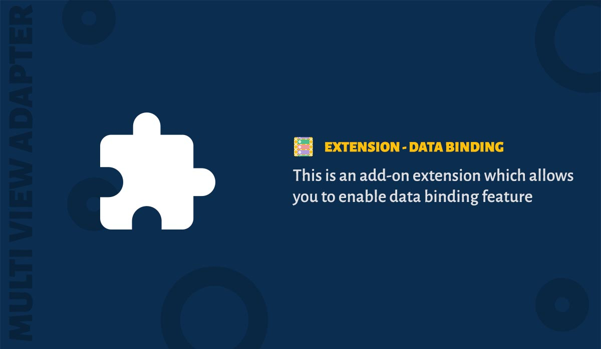

Data binding support is provided as an extension to the adapter. Currently library supports the DataBindingV2.

### Download


```groovy
implementation 'dev.ahamed.mva2:ext-databinding:2.0.0-alpha01'
```

### Usage

Extend your binder classes from the ``DBItemBinder`` class. No viewholder is needed.

```java
public class SampleDataBinder extends DBItemBinder<M, MyBinding> {

  @Override protected void bindModel(M item, MyBinding binding) {
    binding.setModel(item);
  }

  @Override protected MyBinding createBinding(ViewGroup parent) {
    LayoutInflater inflater = LayoutInflater.from(parent.getContext());
    return DataBindingUtil.inflate(inflater, R.layout.item_binding, parent, false);
  }

  @Override public boolean canBindData(Object item) {
    return item instanceof M;
  }
}
```

Incase you need to provide your own view holder just override the method ``createViewHolder`` inside binder class.

```java
  @Override protected YourViewHolder<M, YourBinding> createViewHolder(YourBinding binding) {
    return new YourViewHolder(binding);
  }
```

!> You can use ```ItemBinder``` and ```DBItemBinder``` at the same time inside an adapter.