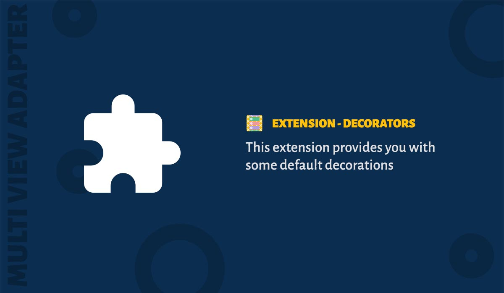

'Decorations' is a simple extension which gives you some basic decorations for your ItemBinders and Sections. It has two decorations as follows :

1. DividerDecoration - Draws a divider between items
2. InsetDecoration - Adds inset around the items

### Download

Latest Version [](https://bintray.com/devahamed/MultiViewAdapter/multi-view-adapter/_latestVersion)

```groovy
implementation 'me.riyazahamed:mva-decorators:x.y.z'
```

### Usage

```java
    InsetDecoration insetDecoration = new InsetDecoration(8); // Adds inset of 8px around items
    DividerDecoration dividerDecoration = new DividerDecoration(context, VERTICAL);

    // Add it to section
    section.addDecoration(insetDecoration);
    section.addDecoration(dividerDecoration);

    // Add it to ItemBinder
    itemBinder.addDecoration(insetDecoration);
    itemBinder.addDecoration(dividerDecoration);
```