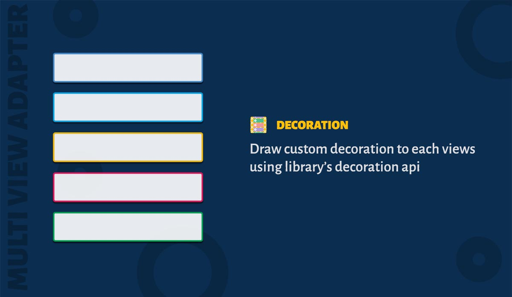

In the gif you might see that each view type has its own ItemDecoration. This is one of the main advantages of the MultiViewAdapter library. It provides a api to draw the item decoration.

1. You can add as many as decorators to ItemBinders or Sections
2. You can use the same decorator and add it to bothe ItemBinder or Section

### How to use?

First step is to add the item decoration to the recyclerview. Get the item decoration from the adapter and set it to your recyclerview.

```java
  MultiViewAdapter adapter = new MultiViewAdapter();
  recyclerView.addItemDecoration(adapter.getItemDecoration());
```

Now create a class which implements ItemDecorator, which can be used with any ItemBinder.

```java
class SampleDecoration implements Decorator {

  @Override public void getItemOffsets(@NonNull Rect outRect, @NonNull View view,
      @NonNull RecyclerView parent, @NonNull RecyclerView.State state, int adapterPosition) {
    outRect.set(left, top, right, bottom);
  }

  @Override public void onDraw(@NonNull Canvas canvas, @NonNull RecyclerView parent,
      @NonNull RecyclerView.State state, View child, int adapterPosition) {
    // Add the onDraw code
  }
}
```

Now add the item decorator to the ItemBinder or Section.

```java
  // Add to itembinder
  itemBinder.addDecorator(new SampleDecoration());
  // or you can add it to a Section
  section.addDecorator(new SampleDecoration());
```

!> The ``getItemOffsets`` and ``onDraw`` methods will be called for each viewholder. Unlike framework's ItemDecoration class, you don't need to add a ``for`` loop here

### Additional API's

There are additional api's in the Decorator class.

1. getPositionType() - Position type of the item inside the section. Kindly read ahead to understand the position type.
2. getSectionPositionType() - Position type of the section inside the adapter. It allows you to identify whether section is first, middle or last inside the adapter.
3. isItemOnLeftEdge() and siblings - Lets you identify whether the item lies on a particular edge.

#### What is position type?


Consider the above image, the item 1 lies at the top-left. Item 10 lies at the bottom-left. To identify such contextful position information the decorator provides you itemPositionType integer. You can use this parameter inside the ```Decorator``` like this.

```java
    // Inside decorator
    int itemPositionType = getPositionType(adapterPosition);
    boolean itemOnLeft = isItemOnLeftEdge(itemPositionType);
    boolean itemOnTop = isItemOnTopEdge(itemPositionType);
```
Similarly, 

1. Item 1 
 * isItemOnLeftEdge() returns true
 * isItemOnTopEdge() returns true
 * isItemOnRightEdge() returns false
 * isItemOnBottomEdge() returns false

2. Item 3
 * isItemOnLeftEdge() returns false
 * isItemOnTopEdge() returns true
 * isItemOnRightEdge() returns true
 * isItemOnBottomEdge() returns false

3. Item 5
 * isItemOnLeftEdge() returns false
 * isItemOnTopEdge() returns false
 * isItemOnRightEdge() returns false
 * isItemOnBottomEdge() returns false

4. Item 11
 * isItemOnLeftEdge() returns false
 * isItemOnTopEdge() returns false
 * isItemOnRightEdge() returns false
 * isItemOnBottomEdge() returns true

#### What about lists?


Considering the above image, itemPositionType will return following values.


1. Item 1 
 * isItemOnLeftEdge() returns true
 * isItemOnTopEdge() returns true
 * isItemOnRightEdge() returns true
 * isItemOnBottomEdge() returns false

2. Item 2
 * isItemOnLeftEdge() returns true
 * isItemOnTopEdge() returns false
 * isItemOnRightEdge() returns true
 * isItemOnBottomEdge() returns false

3. Item 4
 * isItemOnLeftEdge() returns true
 * isItemOnTopEdge() returns false
 * isItemOnRightEdge() returns true
 * isItemOnBottomEdge() returns true

!> By using positionType you will be able to write a single decorator which can be used for both ``LinearLayoutManager`` or ``GridLayoutManager``