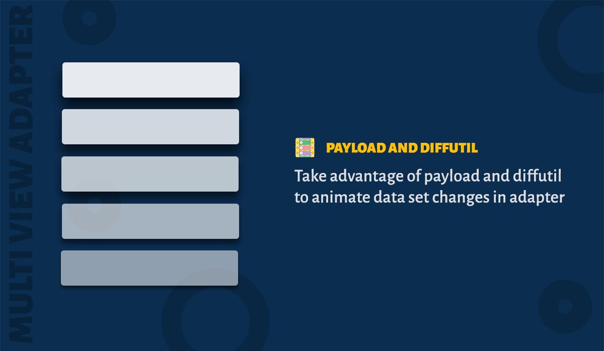

The library takes advantage of payload and diffutil from the recyclerview and calls the correct item animation. With use of RxDiffUtil extension, you can run DiffUtil in the background. 

### Calling proper 'notify' method

Lets take a look at an example to understand the feature better. This sample displays list of news headlines. We are making two updates to the list :

* News item at third position is removed
* News item at first position is updated with a new date

Lets take a look at how animation works on each case

Vanilla Adapter | Default Lib Behavior | Custom PayloadProvider
-------------------- | -------------------- | --------------------
 |  | 

**1. Vanilla Adapter**

List is updated and ``notifyDataSetChanged()`` is called. So we dont get any animations.

**2. Default Library Behavior**

When the list is updated, MultiViewAdapter calculates the diff and applies the changes to adapter. ItemRemove animation is called for position 3. 

But for position 1, ItemRemove animation is followed by ItemAdd animation. Thats why we are seeing flicker at position 1. This is the default behavior of library because the library just calls ``Object.equals()`` method to check the equality of two items. Since the date is changed, equality fails and library decides that the old item was removed and new item is being added.

**3. Custom PayloadProvider**

When the list is updated, MultiViewAdapter calculates the diff using the payload provider. Now the library takes advantage of ``areItemsTheSame()`` and ``areContentsTheSame()`` methods and determines that the item at first position is changed so it calls the correct ItemChange animation. Kindly read below how to set your custom PayloadProvider.


### DiffUtil

Whenever you are updating the data, ``Section`` calculates the difference between the data using the diffutil and applies the updates to the adapter. As an user you never need to call ``notifyDataSetChanged()`` or any other notify methods. You don't need to set-up anything.

But diff is calculated on the main thread. If you would like to run this in the background you can use the [RxDiffUtil Extension](extension/rx_diffutil.md). Or you can add your own diffutil like this,

```java
    section.setDiffUtil(new MvaDiffUtil<SampleItem>() {
      @Override
      public void calculateDiff(ListUpdateCallback listUpdateCallback, List<SampleItem> oldList,
          List<SampleItem> newList) {
        // Calculate the diff here
      }
    });
```

### PayloadProvider

PayloadProvider is an interface which has two methods ``areContentsTheSame`` and ``getChangePayload``. These methods are called on DiffUtil's callback. 

```java
    section.setPayloadProvider(new PayloadProvider<SampleItem>() {
      @Override public boolean areContentsTheSame(SampleItem oldItem, SampleItem newItem) {
        return false; // Check whether contents are same ie., newItem.equals(oldItem)
      }

      @Override public boolean areItemsTheSame(SampleItem oldItem, SampleItem newItem) {
        return false; // Check whether items are same. ie., oldItem.id == newItem.id
      }

      @Override public Object getChangePayload(SampleItem oldItem, SampleItem newItem) {
        return null; // Return the change payload or null
      }
    });
```

###### Override bind method in ItemBinder

Additionally you need to override ``bindViewHolder(ViewHolder holder, M item, List payloads)`` inside your ItemBinder.

```java
public class BinderWithPayload extends ItemBinder<Flower, BinderWithPayload.ViewHolder> {

  @Override public void bind(ViewHolder holder, Flower item, List payloads) {
    // Do additional payload operation here
  }

  @Override public void bind(ViewHolder holder, Flower item) {
    // Regular viewbinding here
  }
}
```
