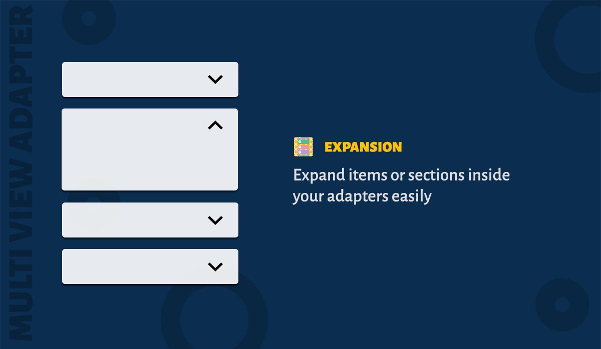

MultiViewAdapter allows you to expand/collapse a single item or an entire section. There are four types of expansion mode available.

1. SINGLE - Only one item/section can be expanded. 
2. MULTIPLE - Multiple items/sections can be expanded.
3. INHERIT - Inherits the property from the parent. This the default value for sections.
4. NONE - Disables the expansion mode. This the default expansion mode for the adapter.


### How to use?

Set expansion mode to the adapter.
 
```java
    // Single item
    adapter.setExpansionMode(Mode.SINGLE);

    // Sections
    adapter.setSectionExpanionMode(Mode.SINGLE);
```

To expand/collapse an item, inside the viewholder call ``ItemViewHolder.toggleItemExpansion()`` method. Similarly to expand/collapse a section, call ``ItemViewHolder.toggleSectionExpansion()`` method. For example,

```java
  static class ViewHolder extends BaseViewHolder<SelectableItem> {

    ViewHolder(View itemView) {
      super(itemView);
      itemView.setOnClickListener(new View.OnClickListener() {
        @Override public void onClick(View view) {
          toggleItemExpansion();
          // or
          toggleSectionExpansion();
        }
      });
    }
  }
```

To check whether the item is selected call ```ItemViewHolder.isItemSelected()```. For example,

```java
  public class YourItemBinder extends ItemBinder<SelectableItem> {

    @Override public void bindViewHolder(ViewHolder holder, SelectableItem item) {
      if(holder.isItemExpanded()) {
        // Item is expanded.
      } 
      // or
      if(holder.isSectionExpanded()) {
        // Section is expanded. 
      } 
    }
  }
```

### Advanced Usage

What if you want to support both single and multiple expansion? With MultiViewAdapter, you can build a recyclerview adapter with multiple combination of expansion mode inside a single adapter. You can set expansion modes to the section by calling ```Section.setExpansionMode(Mode)```

!> Take a look at sample app's 'Expansion' demo. It will help you understand the feature offered by the library.

