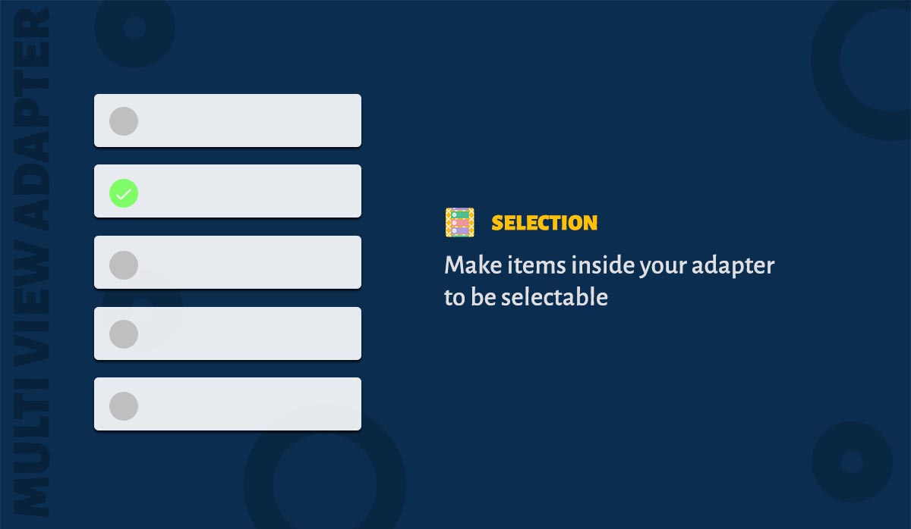
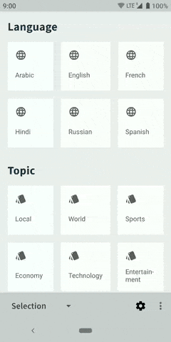

## Table of contents

1. [Introduction](#_1-introduction)
2. [Usage](#_2-usage)
3. [Get selected items](#_3-get-selected-items)
4. [Set listener](#_4-set-listener)
5. [Clear selections](#_5-clear-selections)
6. [Advanced usage](#_6-advanced-usage)

### 1. Introduction

MultiViewAdapter provides easy way to add selection/choice mode for the recyclerview. There are four types of mode available

1. SINGLE - Only one item can be selected. 
2. MULTIPLE - Multiple items can be selected.
3. INHERIT - Inherits the property from the parent. This the default value for sections.
4. NONE - Disables the selection mode.

### 2. Usage

Just set selection mode to the adapter.

```java
    adapter.setSelectionMode(Mode.SINGLE);
```

To select an item, inside the viewholder call ``ItemViewHolder.toggleItemSelection()`` method. For example,

```java
  static class ViewHolder extends BaseViewHolder<SelectableItem> {

    ViewHolder(View itemView) {
      super(itemView);
      itemView.setOnClickListener(new View.OnClickListener() {
        @Override public void onClick(View view) {
          toggleItemSelection();
        }
      });
    }
  }
```

To check whether the item is selected call ```ItemViewHolder.isItemSelected()```. For example,

```java
  public class YourItemBinder extends ItemBinder<SelectableItem> {

    @Override public void bindViewHolder(ViewHolder holder, SelectableItem item) {
      if(holder.isItemSelected()) {
        // Item is selected. Set different color or show a checkmark
      } 
    }
  }
```

### 3. Get selected items

You can get selected items for a ListSection. Just call getter method.

```java
  section.getSelectedItems();
```

### 4. Set listener

You can set a listener to get a callback when item/s are selected or unselected.

```java
  SelectionChangedListener<M> listener = new SelectionChangedListener<M>() {
        @Override
        public void onSelectionChanged(M item, boolean isSelected, List<M> selectedItems) {
           // Write your code
        }
     });
  section.setSelectionChangedListener(listener);
```

### 5. Clear Selections

You can clear all selected items for a ListSection.

```java
  section.clearSelections();
```

### 6. Advanced Usage



What if you are building a complex filter screen? What if the recyclerview has to support both single and multiple selections? With MultiViewAdapter, you can build a recyclerview adapter with multiple combination of selection mode inside a single adapter.

Since sections support selection modes, you can set different selection mode different from the adapter. You can group the sections using NestedSection and set selection mode to NestedSection which is different from the adapter. This lets you have different combinations of selection modes. You can set a selection mode to sections by calling ```Section.setSelectionMode(Mode)```.

!> Take a look at sample app's 'Selection' demo. It has a filter screen with most complex combination of the selection mode. It will definitely give the idea about this powerful features.