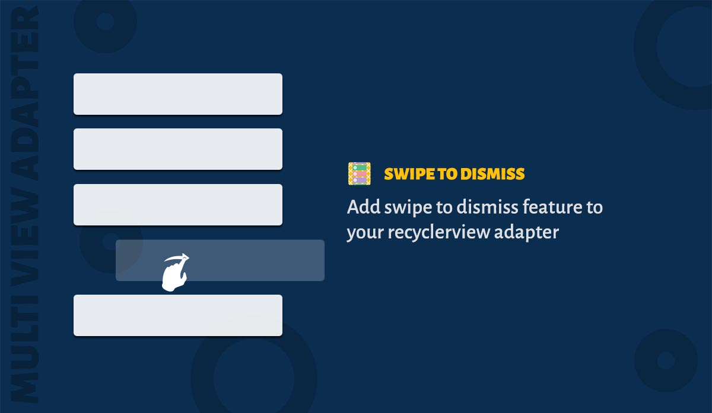

### Usage

Swipe to dismiss gesture can be added in two simple steps.

1. Attach your RecyclerView to the adapter's ``ItemTouchHelper``.

```java
  adapter.getItemTouchHelper().attachToRecyclerView(recyclerView);
```

2. Override ``getSwipeDirections()`` inside your viewholder class.

```java
    @Override public int getSwipeDirections() {
      return ItemTouchHelper.LEFT | ItemTouchHelper.RIGHT;
    }
```

### Adding listener

You can add a listener to know when the items are swiped and dismissed. Set the listener to the ``ListSection``

```java
  listSection.setSwipeToDismissListener(new SwipeToDismissListener<SampleModel>() {
      @Override public void onItemDismissed(int position, SampleModel item) {
        // You can show a undo snackbar here.
      }
    });
```