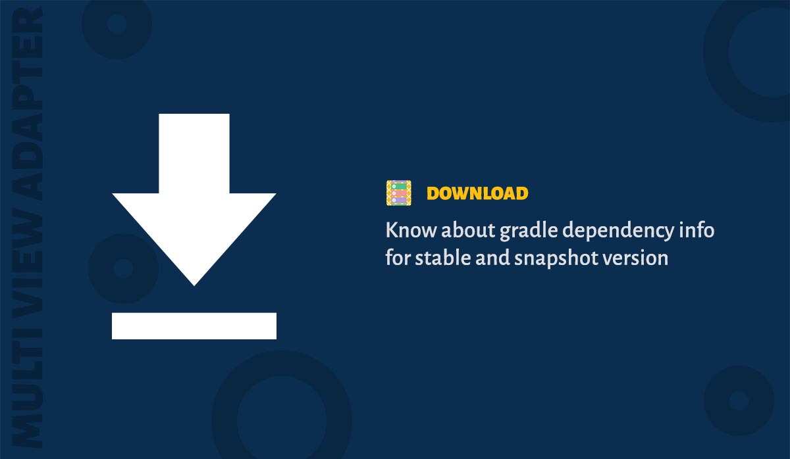

The library is available via [JCenter](https://bintray.com/devahamed/MultiViewAdapter/multi-view-adapter/view) and Maven Central. The minimum API level supported by this library is API 16.

### Adding Library

```gradle
dependencies {
    implementation 'dev.ahamed.mva2:adapter:2.0.0-alpha01'
}
```

### Adding Extension

```gradle
dependencies {
    implementation 'dev.ahamed.mva2:ext-data-binding:2.0.0-alpha01' // DataBinding
    implementation 'dev.ahamed.mva2:ext-decorators:2.0.0-alpha01'   // Decorators
    implementation 'dev.ahamed.mva2:ext-rxdiffutil:2.0.0-alpha01'   // RxDiffUtil
}
```

### Using Snapshot Version

Just add '-SNAPSHOT' to the version name

```gradle
dependencies {
    implementation 'dev.ahamed.mva2:adapter:2.0.0-SNAPSHOT' // Library
}
```

To use the above sanpshot version add the following to your project's gradle file

```gradle
allprojects {
    repositories {
        maven {
            url 'https://oss.jfrog.org/artifactory/oss-snapshot-local'
        }
    }
}
```


### Proguard

The library plays nice with proguard. There is no proguard config needed at your end.