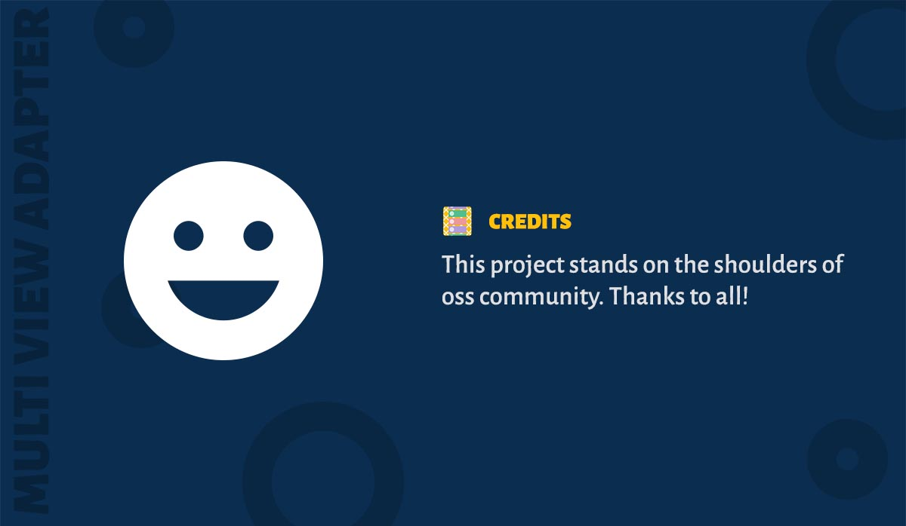

We would like to acknowledge the following services/libraries/resources which helped us in creating this project. Without these credited works this project is not possible. The credits are listed alphabetically. 

### AndroidX (AOSP)

Ofcourse. This library depends on the AndroidX's RecyclerView. Apart from this, the sample app uses various components from AndroidX.

Website : https://source.android.com/  
Pricing : Free  
License : [Apache 2.0](https://source.android.com/license)

### Artifactory OSS

JFrog’s Artifactory open source project is an repository manager. We use it to host library's snapshot builds.

Website : https://jfrog.com/open-source/  
Pricing : Free for opensource projects.  
License : NA

### Bintray

Bintray is the distribution platform which is used to serve the artifacts of this library. We use bintray's infrastructure to deploy the artifacts into both JCenter and Maven Central. JCenter is part of bintray.

Website : https://bintray.com/  
Pricing : Free. The project is using the OSS license from bintray.  
License : NA

### Bitrise

Bitrise is a continuous integration and continuous delivery service for mobile apps. We use bitrise to build the library and sample app after every code push, run the tests, push the code coverage report and deploy weekly snapshots.  

Website : https://www.bitrise.io/  
Pricing : Free. The project is using the free tier.  
License : NA

### Codecov

Codecov provides highly integrated tools to group, merge, archive, and compare coverage reports. This helps us understand how the code coverage got affected in each pull request.

Website : https://codecov.io/  
Pricing : Free. The project is using OSS license.  
License : NA

### Docsify

Docsify is a magical documentation site generator. We use docsify to create the documentation for the project.

Website : https://docsify.js.org/  
Pricing : Free  
License : [MIT](https://github.com/docsifyjs/docsify/blob/master/LICENSE)

### Github

GitHub is a development platform to host and review code, manage projects, and build software. 

Website : https://github.com/  
Pricing : Free for opensource projects.  
License : NA

!> Though we were careful in listing credits, if we missed anything kindly create a pull request/issue [here](https://github.com/DevAhamed/MultiViewAdapter).