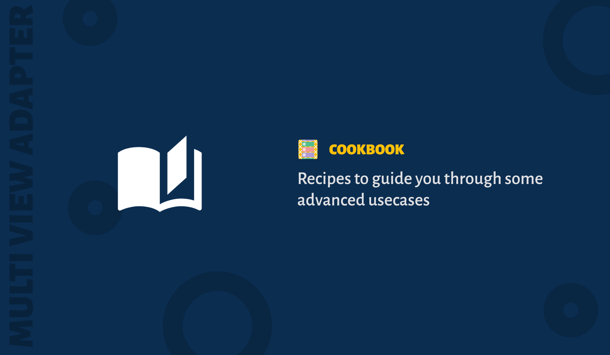

Recipes which focuses on solving key-problems or advanced use-cases. They are more advanced than tutorials and assume some knowledge of how MultiViewAdapter works.

> If you have created a recipe for MultiViewAdapter and want to let the community know, create a pull-request to add it here.

## Recipes

1. Adding both single-selection and multi-selection to adapters - [Recipe link](https://android.jlelse.eu/recyclerview-selection-easily-make-your-adapter-items-selectable-571981ce5e12)